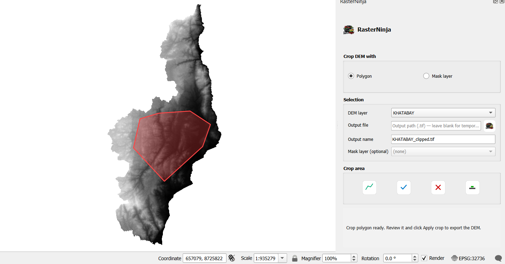
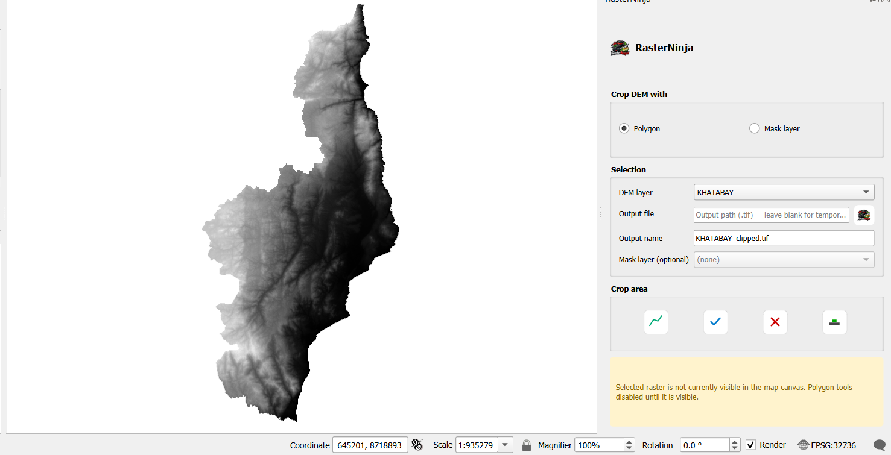

# RasterNinja

RasterNinja is a QGIS plugin that simplifies raster/DEM workflows. Draw a polygon or use an existing polygon mask to clip/trim rasters and get a temporary clipped raster added to the project. RasterNinja is intended as a foundation for more raster tools (merging, format conversion, DEM calculations, classification toggles).

Key features
- Draw-mode polygon clipping: draw a polygon directly on the map canvas, finish the polygon, and clip the selected raster.
- Mask-layer clipping: choose an existing polygon vector layer (shapefile or memory layer) as the mask to clip a raster.
- Temporary outputs by default: when no output file path is supplied the plugin adds the clipped raster as a temporary layer so users can save it if desired.
- Compact icon-only toolbar in the dock, with clear tooltips and small padding for space efficiency.

Screenshots

Installation
1. Download the latest release ZIP from https://github.com/hobbybwanali/RasterNinja/releases or clone the repository.
2. Copy the `RasterNinja` folder into your QGIS profile's `python/plugins` directory (for example: `%APPDATA%\\QGIS\\QGIS3\\profiles\\default\\python\\plugins\\`).
3. Restart QGIS.
4. Enable RasterNinja from Plugins > Manage and Install Plugins.

Usage
1. Open RasterNinja using the toolbar button (the Ninja icon) — this toggles the dock panel.
2. Ensure a georeferenced raster (GeoTIFF) is loaded; it will appear in the "DEM layer" dropdown.
3. By default the "Polygon" mode is selected: use Draw → left-click on the canvas to add vertices. Use Finish to close the polygon and Apply to clip.
4. Alternatively choose "Mask layer", select a polygon vector layer from the Mask dropdown and click Apply.
5. If you left the Output file blank, the clipped raster will be added as a temporary layer to the project. Save it from the Layers panel to persist.

Author
- Hobby Bwanali — hobbybwanali@gmail.com
- GitHub: https://github.com/hobbybwanali

Contributing
Contributions, bug reports, and feature requests are welcome. Please open issues or pull requests on the GitHub repository.

License
This project is licensed under the MIT License — see the LICENSE file for details.

Quick QA checklist
1. Restart QGIS and enable RasterNinja in the Plugin Manager.
2. Open the RasterNinja panel (toolbar button). Confirm the Ninja icon and title appear in the panel header.
3. Load GeoTIFF rasters. Confirm they appear in the DEM dropdown.
4. Draw & finish a polygon, then Apply. Confirm temporary output and success message.

If you need alternative text or extra screenshots added, provide the images and I will add them to `doc/` and embed them in the README.
